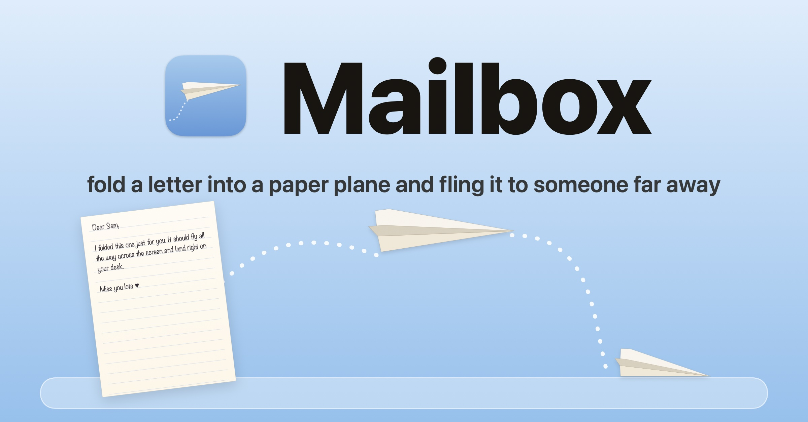

# Mailbox

Paper-plane letters for two people far apart.
Write a letter, watch it fold itself into a paper plane, and fling it off your screen. It flies onto the other person's Mac and lands on their Dock. They click it, and it unfolds back into your letter.

## Download

**[⬇ Download Mailbox for Mac](https://github.com/inkstaid/Mailbox/releases/latest/download/Mailbox.dmg)**: macOS 13 Ventura or later, Apple Silicon and Intel. You both need a Mac.

## Install

1. Open `Mailbox.dmg` and drag **Mailbox** onto **Applications**.
2. Open Mailbox from Applications.
3. The first time, macOS will say it can't verify the app (it isn't from the App Store). Click **Done**, then go to
   **System Settings → Privacy & Security**, scroll down and click **Open Anyway** next to Mailbox. You only do this once.

A ✈ appears in your menu bar, with your name next to it. Everything lives there.

## Connect with your person

1. ✈ → type your name → **Move in** → **Create our home**. You get a code like `KQ7M-2XHP`.
2. Send them the code. On their Mac: ✈ → their name → **Move in** → paste the code → **Join**.
3. You're connected. A code works once, for 48 hours.

## Send a letter

| Do this | What happens |
|---|---|
| ✈ → Write a letter | A sheet of paper, ready for you |
| Fold & send ✈︎ (or ⌘↩) | It folds itself into a paper plane |
| Fling the plane off the screen | It flies away… and onto their desk |
| A plane lands on your Dock | Click it, and it unfolds into their letter |
| ✈ menu | What you sent (In the air · Landed · Unfolded ♥) and every letter you've kept |

If they're offline, the plane waits and flies in the moment they're back.

## Good to know

- Your account lives on this Mac: there's no email or password yet, so there's nothing to sign out of. Uninstalling and deleting the app's data means making a new home.
- Letters are stored on a server so they reach your person even when their Mac is off. Nobody else using Mailbox can see them.

---

Made by [Parul Aggarwal](https://helloparul.in) · a side quest
